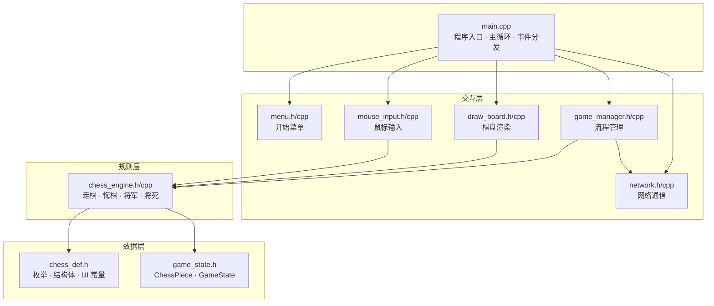

# 3.1.1 程序组成框图

```mermaid
graph TB
    subgraph layer1[" "]
        main["main.cpp<br/>程序入口 · 主循环 · 事件分发"]
    end

    subgraph layer2["交互层"]
        menu["menu.h/cpp<br/>开始菜单"]
        mouse["mouse_input.h/cpp<br/>鼠标输入"]
        draw["draw_board.h/cpp<br/>棋盘渲染"]
        mgr["game_manager.h/cpp<br/>流程管理"]
        net["network.h/cpp<br/>网络通信"]
    end

    subgraph layer3["规则层"]
        engine["chess_engine.h/cpp<br/>走棋 · 悔棋 · 将军 · 将死"]
    end

    subgraph layer4["数据层"]
        defs["chess_def.h<br/>枚举 · 结构体 · UI 常量"]
        state["game_state.h<br/>ChessPiece · GameState"]
    end

    main --> menu
    main --> mouse
    main --> draw
    main --> mgr
    main --> net

    mouse --> engine
    mgr --> engine
    draw --> engine
    mgr --> net

    engine --> defs
    engine --> state
```
