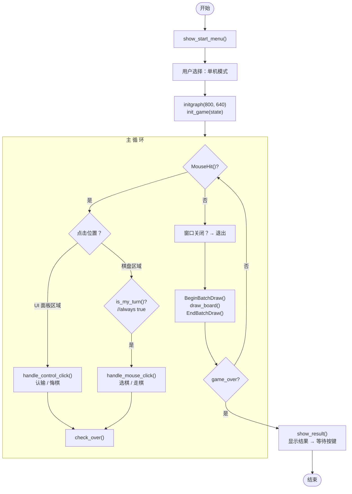

# 3.1.2a 单机模式流程图

```mermaid
flowchart TD
    A([开始]) --> B["show_start_menu()"]
    B --> C["用户选择：单机模式"]
    C --> D["initgraph(800, 640)<br/>init_game(state)"]
    D --> E

    subgraph E["主 循 环"]
        direction TB
        F{"MouseHit()?"}
        G{"点击位置？"}

        H["handle_control_click()<br/>认输 / 悔棋"]
        I{"is_my_turn()? 
        //always true"}
        J["handle_mouse_click()<br/>选棋 / 走棋"]
        K["check_over()"]

        L["窗口关闭？→ 退出"]

        M["BeginBatchDraw()<br/>draw_board()<br/>EndBatchDraw()"]

        N{game_over?}
    end

    F -->|是| G
    F -->|否| L
    G -->|UI 面板区域| H --> K
    G -->|棋盘区域| I
    I -->|是| J --> K


    L --> M --> N
    N -->|否| F
    N -->|是| O["show_result()<br/>显示结果 → 等待按键"]
    O --> P([结束])
```
