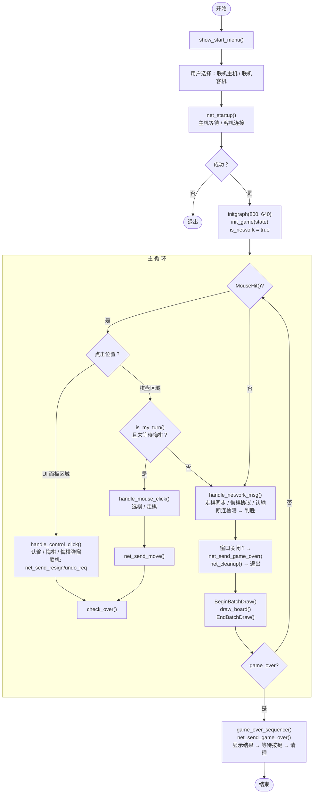

# 3.1.2b 联机模式流程图

```mermaid
flowchart TD
    A([开始]) --> B["show_start_menu()"]
    B --> C["用户选择：联机主机 / 联机客机"]
    C --> D["net_startup()<br/>主机等待 / 客机连接"]
    D --> E{成功？}
    E -->|否| EXIT([退出])

    E -->|是| F["initgraph(800, 640)<br/>init_game(state)<br/>is_network = true"]

    F --> G

    subgraph G["主 循 环"]
        direction TB
        H{"MouseHit()?"}
        I{"点击位置？"}

        J["handle_control_click()<br/>认输 / 悔棋 / 悔棋弹窗<br/>联机: net_send_resign/undo_req"]
        K{"is_my_turn()<br/>且未等待悔棋？"}
        L["handle_mouse_click()<br/>选棋 / 走棋"]
        L2["net_send_move()"]
        M["check_over()"]

        N["handle_network_msg()<br/>走棋同步 / 悔棋协议 / 认输<br/>断连检测 → 判胜"]

        O["窗口关闭？→<br/>net_send_game_over()<br/>net_cleanup() → 退出"]

        P["BeginBatchDraw()<br/>draw_board()<br/>EndBatchDraw()"]

        Q{game_over?}
    end

    H -->|是| I
    H -->|否| N
    I -->|UI 面板区域| J --> M
    I -->|棋盘区域| K
    K -->|是| L --> L2 --> M
    K -->|否| N

    N --> O --> P --> Q
    Q -->|否| H
    Q -->|是| R["game_over_sequence()<br/>net_send_game_over()<br/>显示结果 → 等待按键 → 清理"]
    R --> END([结束])
```
