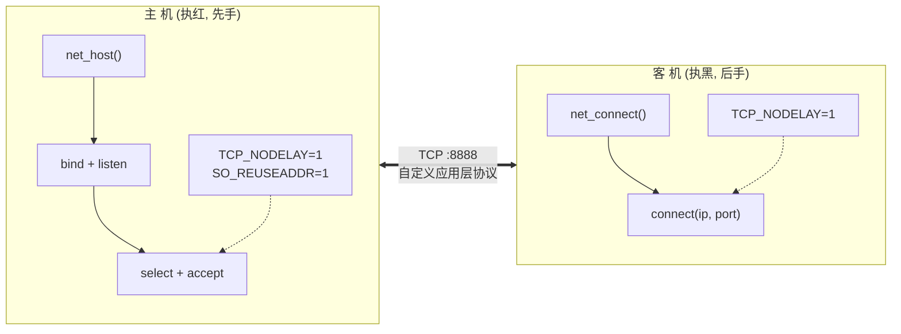
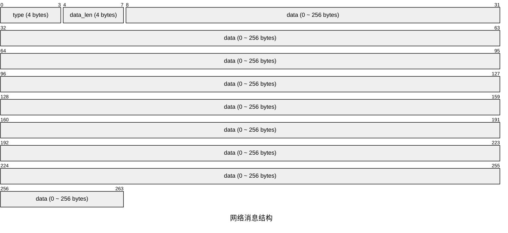
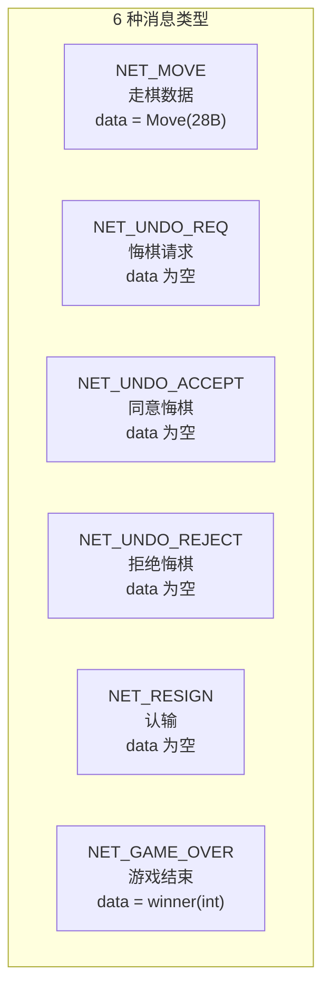
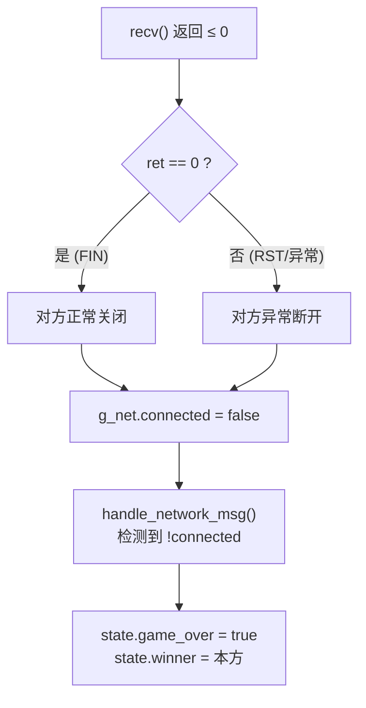

# 3.1.3 联机通信架构

## 通信拓扑

```mermaid
flowchart LR
    subgraph host["主 机 (执红, 先手)"]
        direction TB
        H1["net_host()"]
        H2["bind + listen"]
        H3["select + accept"]
        H4["TCP_NODELAY=1<br/>SO_REUSEADDR=1"]
        H1 --> H2 --> H3
        H4 -.-> H3
    end

    subgraph client["客 机 (执黑, 后手)"]
        direction TB
        C1["net_connect()"]
        C2["connect(ip, port)"]
        C3["TCP_NODELAY=1"]
        C1 --> C2
        C3 -.-> C2
    end

    host <==>|"TCP :8888<br/>自定义应用层协议"| client
```

## 消息格式

```mermaid
packet-beta
    title 网络消息结构
    0-3: "type (4 bytes)"
    4-7: "data_len (4 bytes)"
    8-263: "data (0 ~ 256 bytes)"
```

## 消息类型

```mermaid
flowchart LR
    subgraph msgs["6 种消息类型"]
        direction LR
        M1["NET_MOVE<br/>走棋数据<br/>data = Move(28B)"]
        M2["NET_UNDO_REQ<br/>悔棋请求<br/>data 为空"]
        M3["NET_UNDO_ACCEPT<br/>同意悔棋<br/>data 为空"]
        M4["NET_UNDO_REJECT<br/>拒绝悔棋<br/>data 为空"]
        M5["NET_RESIGN<br/>认输<br/>data 为空"]
        M6["NET_GAME_OVER<br/>游戏结束<br/>data = winner(int)"]
    end
```

## 断连检测

```mermaid
flowchart TD
    A["recv() 返回 ≤ 0"] --> B{ret == 0 ?}
    B -->|"是 (FIN)"| C["对方正常关闭"]
    B -->|"否 (RST/异常)"| D["对方异常断开"]
    C --> E["g_net.connected = false"]
    D --> E
    E --> F["handle_network_msg()<br/>检测到 !connected"]
    F --> G["state.game_over = true<br/>state.winner = 本方"]
```
