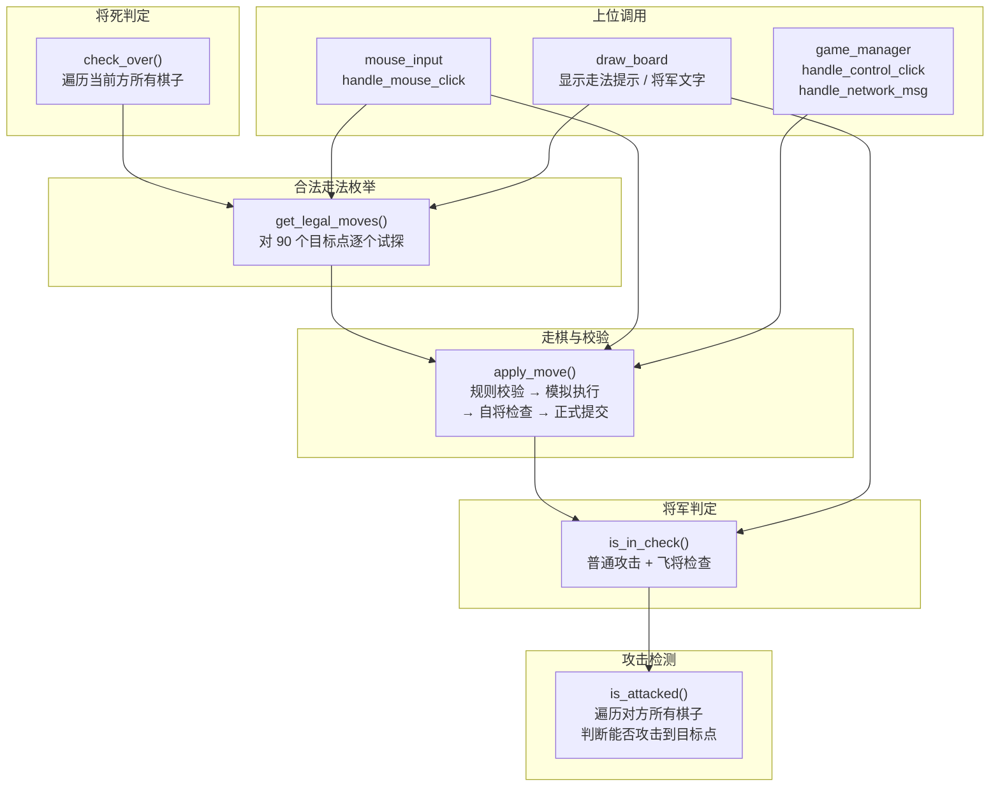

# 3.2.3 象棋引擎函数调用关系图

```mermaid
flowchart TD
    subgraph 将死判定
        A["check_over()<br/>遍历当前方所有棋子"]
    end

    subgraph 合法走法枚举
        B["get_legal_moves()<br/>对 90 个目标点逐个试探"]
    end

    subgraph 走棋与校验
        C["apply_move()<br/>规则校验 → 模拟执行<br/>→ 自将检查 → 正式提交"]
    end

    subgraph 将军判定
        D["is_in_check()<br/>普通攻击 + 飞将检查"]
    end

    subgraph 攻击检测
        E["is_attacked()<br/>遍历对方所有棋子<br/>判断能否攻击到目标点"]
    end

    subgraph 上位调用
        F["mouse_input<br/>handle_mouse_click"]
        G["game_manager<br/>handle_control_click<br/>handle_network_msg"]
        H["draw_board<br/>显示走法提示 / 将军文字"]
    end

    A --> B --> C --> D --> E
    F --> C
    F --> B
    G --> C
    H --> B
    H --> D
```
